# Jenkins LTS - Nginx - Docker-in-Docker

**What is Jenkins?**

- Jenkins offers a simple way to set up a continuous integration or continuous delivery environment for almost any combination of languages and source code repositories using pipelines, as well as automating other routine development tasks. While Jenkins doesn’t eliminate the need to create scripts for individual steps, it does give you a faster and more robust way to integrate your entire chain of build, test, and deployment tools than you can easily build yourself.


This work is based on the Official Jenkins Docker Image (**jenkins/jenkins:lts**) [[1](https://github.com/jenkinsci/docker)].

Docker doesn't recommend running the Docker daemon inside a container (except for very few use cases like developing Docker itself), and the solutions to make this happen are generally hacky and/or unreliable.

Fear not though, there is an easy workaround: mount the host machine's Docker socket in the container. This will allow your container to use the host machine's Docker daemon to run containers and build images.

Your container still needs compatible Docker client binaries in it, but I have found this to be acceptable for all my use cases. [[2](https://getintodevops.com/blog/the-simple-way-to-run-docker-in-docker-for-ci)]

## Table of Contents

- [Prerequisites](#prereq)
- [Configuration](#config)
- [Build the Jenkins image](#build)
- [Basic Deployment using http](#http)
- [Basic Deployment using https and SSL](#https)
- [Custom Deployment using https with SSL and URL-slug /jenkins](#custom)
- [SSL Certificates](#ssl-certs)
- [Docker in Docker test](#dind)
- [Trouble Shooting](#debugging) - debugging common issues
- [References](#ref)

## <a name="prereq"></a>Prerequisites

### Docker and Compose

This project makes use of both Docker and Docker Compose and it is left to the user to have these installed properly on their system ahead of time.

### Create directories on host

In order to persist data the user should create directories on the host to be volume mounted to the docker containers. This allows the user to persist data beyond the scope of the container itself. If volumes are not persisted to the host the user runs the risk of losing their data when the container is updated or removed.

- **jenkins_home**: The Jenkins application and job files
- **logs/nginx**: The Nginx log files (error.log, access.log)


These directories can be located anywhere on the host that is reachable by the docker-compose script, and will be placed at the top level of the repository for this example.

```console
mkdir -p jenkins_home/ logs/nginx/
```

**NOTE**: for permissions reasons it is important for the user to create these directories prior to issuing the docker-compose command. If the directories do not already exist when the containers are started, the directories will be created at start time and will be owned by the **root** user of the container process. This can lead to access denied permission issues at runtime.

### Docker version

The version of Docker being run inside the container should be the same as the host it is being deployed on to mitigate against unforeseen issues.

The version can be set by adjusting the [Dockerfile](Dockerfile) value for `ARG BUILDER_TAG=` to be either `latest` (default) or `custom`.

If using `custom` be sure to set the value of `CUSTOM_VERSION=` to correspond to the same version of `docker-ce` that is running on the host. The default value is `5:20.10.5~3-0~debian-buster`.

The version of `docker-ce` on the host can be found by issuing a `docker version` call.

- Example:

    ```console
    $ docker version
    Client: Docker Engine - Community
     Cloud integration: 1.0.9
     Version:           20.10.5
     API version:       1.41
     Go version:        go1.13.15
     Git commit:        55c4c88
     Built:             Tue Mar  2 20:13:00 2021
     OS/Arch:           darwin/amd64
     Context:           default
     Experimental:      true
    
    Server: Docker Engine - Community
     Engine:
      Version:          20.10.5
      API version:      1.41 (minimum version 1.12)
      Go version:       go1.13.15
      Git commit:       363e9a8
      Built:            Tue Mar  2 20:15:47 2021
      OS/Arch:          linux/amd64
      Experimental:     true
     containerd:
      Version:          1.4.3
      GitCommit:        269548fa27e0089a8b8278fc4fc781d7f65a939b
     runc:
      Version:          1.0.0-rc92
      GitCommit:        ff819c7e9184c13b7c2607fe6c30ae19403a7aff
     docker-init:
      Version:          0.19.0
      GitCommit:        de40ad0
    ```
    
    In this example the version was found to be `20.10.5`, so the value of `docker_version` in the [Dockerfile](Dockerfile) should be set to `5:20.10.5~3-0~debian-buster` prior to building the image.

- Debian:buster based versions of `docker-ce` available as of 2021-04-01:

    ```console
    # apt-cache madison docker-ce | tr -s ' ' | cut -d '|' -f 2
     5:20.10.5~3-0~debian-buster
     5:20.10.4~3-0~debian-buster
     5:20.10.3~3-0~debian-buster
     5:20.10.2~3-0~debian-buster
     5:20.10.1~3-0~debian-buster
     5:20.10.0~3-0~debian-buster
     5:19.03.15~3-0~debian-buster
     5:19.03.14~3-0~debian-buster
     5:19.03.13~3-0~debian-buster
     5:19.03.12~3-0~debian-buster
     5:19.03.11~3-0~debian-buster
     5:19.03.10~3-0~debian-buster
     5:19.03.9~3-0~debian-buster
     5:19.03.8~3-0~debian-buster
     5:19.03.7~3-0~debian-buster
     5:19.03.6~3-0~debian-buster
     5:19.03.5~3-0~debian-buster
     5:19.03.4~3-0~debian-buster
     5:19.03.3~3-0~debian-buster
     5:19.03.2~3-0~debian-buster
     5:19.03.1~3-0~debian-buster
     5:19.03.0~3-0~debian-buster
     5:18.09.9~3-0~debian-buster
     5:18.09.8~3-0~debian-buster
     5:18.09.7~3-0~debian-buster
     5:18.09.6~3-0~debian-buster
     5:18.09.5~3-0~debian-buster
     5:18.09.4~3-0~debian-buster
     5:18.09.3~3-0~debian-buster
     5:18.09.2~3-0~debian-buster
     5:18.09.1~3-0~debian-buster
     5:18.09.0~3-0~debian-buster
    ```
 
  Versions are subject to change as time goes on and keeping this reference up to date is outside of the scope of this document.


### UID/GID

The UID and GID of the `jenkins` user that runs within the container are modifiable to allow the mounting of host volumes to the container to match that of a user on the host.

The Jenkins Docker image creates a user named `jenkins` with `UID/GID` = `1000/1000`. This is not always an ideal UID/GID pairing when wanting to use mounted volumes, so the notion of changing the UID/GID of the jenkins user exists.

In order to facilitate this the `root` user must issue some commands at start up, and thus a new `docker-entrypoint.sh` script has been introduced. This new script then calls the original `jenkins.sh` script as the `jenkins` user on it's way out.

The new `docker-entrypoint.sh` script is prefixed to use Tini [[4](https://github.com/krallin/tini/issues/8)] as was the case for the `jenkins.sh` script from the original image.

## <a name="config"></a>Configuration

### .env

For convenience a `.env` file has been included for setting certain environment variables. These can be adjusted to suit your specific environment, and have the following default values.

```env
# jenkins - jenkins.nginx.docker:lts
UID_JENKINS=1000
GID_JENKINS=1000
JENKINS_HOME=./jenkins_home             # <-- same as directory created above
JENKINS_OPTS="--prefix=/jenkins"

# nginx - nginx:latest
NGINX_DEFAULT_CONF=./nginx/default.conf
NGINX_LOGS=./logs/nginx/jenkins         # <-- same as directory created above
NGINX_SSL=./ssl                         # <-- location of SSL certs on host
```

### Nginx

There are three files in the `nginx` directory, and which one you use depends on whether you want to serve your site using HTTP or HTTPS.

Files in the `nginx` directory:

- `default.conf` - Configuration for running locally at 127.0.0.1 on port 8080 using http
- `default.conf.http_template` - Configuration template for running locally at 127.0.0.1 on port 8080 using http
- `default.conf.https_template` - Configuration template for running locally at 127.0.0.1 on port 8443 using https and SSL


```nginx
upstream jenkins_app {
  keepalive 32; # keepalive connections
  server jenkins:8080; # jenkins ip and port
}

# Required for Jenkins websocket agents
map $http_upgrade $connection_upgrade {
  default upgrade;
  '' close;
}

server {
  listen          80;       # Listen on port 80 for IPv4 requests

  server_name     127.0.0.1;  # replace '127.0.0.1' with your server domain name

  # this is the jenkins web root directory
  # (mentioned in the /etc/default/jenkins file)
  root            /var/run/jenkins/war/;

  access_log      /var/log/nginx/jenkins/access.log;
  error_log       /var/log/nginx/jenkins/error.log;

  # pass through headers from Jenkins that Nginx considers invalid
  ignore_invalid_headers off;

  location ~ "^/static/[0-9a-fA-F]{8}\/(.*)$" {
    # rewrite all static files into requests to the root
    # E.g /static/12345678/css/something.css will become /css/something.css
    rewrite "^/static/[0-9a-fA-F]{8}\/(.*)" /$1 last;
  }

  location /userContent {
    # have nginx handle all the static requests to userContent folder
    # note : This is the $JENKINS_HOME dir
    root /var/lib/jenkins/;
    if (!-f $request_filename){
      # this file does not exist, might be a directory or a /**view** url
      rewrite (.*) /$1 last;
      break;
    }
    sendfile on;
  }

  location / {
      sendfile off;
      proxy_pass         http://jenkins_app/;
      proxy_http_version 1.1;

      # Required for Jenkins websocket agents
      proxy_set_header   Connection        $connection_upgrade;
      proxy_set_header   Upgrade           $http_upgrade;

      proxy_set_header   Host              $host;
      proxy_set_header   X-Real-IP         $remote_addr;
      proxy_set_header   X-Forwarded-For   $proxy_add_x_forwarded_for;
      proxy_set_header   X-Forwarded-Proto $scheme;
      proxy_set_header   X-Forwarded-Host  $server_name;
      proxy_set_header   X-Forwarded-Port  8080; # replace '8080' with your server port number
      proxy_max_temp_file_size 0;

      #this is the maximum upload size
      client_max_body_size       10m;
      client_body_buffer_size    128k;

      proxy_connect_timeout      90;
      proxy_send_timeout         90;
      proxy_read_timeout         90;
      proxy_buffering            off;
      proxy_request_buffering    off; # Required for HTTP CLI commands
      proxy_set_header Connection ""; # Clear for keepalive
  }

}
```

### docker-compose.yml

The docker-compose.yml file defines how to orchestrate the containers when deployed and makes use of the parameters set in the `.env` file.

```yaml
version: '3.8'
services:

  jenkins:
    image: jenkins.nginx.docker:lts
    build:
      context: ./
      dockerfile: Dockerfile
    container_name: jenkins
    ports:
      - '2022:22'
      - '50000:50000'
      - '50022:50022'
    volumes:
      - ${JENKINS_HOME:-./jenkins_home}:/var/jenkins_home
      - /var/run/docker.sock:/var/run/docker.sock
    environment:
      - UID_JENKINS=${UID_JENKINS:-1000}
      - GID_JENKINS=${GID_JENKINS:-1000}
    #  - JENKINS_OPTS=${JENKINS_OPTS:-"--prefix=/jenkins"}
    restart: always

  nginx:
    image: nginx:latest
    container_name: nginx
    ports:
      - '8080:80'
    #  - '8443:443'
    volumes:
      - ${NGINX_DEFAULT_CONF:-./nginx/default.conf}:/etc/nginx/conf.d/default.conf
      - ${NGINX_LOGS:-./logs/nginx/jenkins}:/var/log/nginx/jenkins
    #  - ${NGINX_SSL:-./ssl}:/etc/ssl:ro
    restart: always
```

## <a name="build"></a>Build the Jenkins image

Once satisfied with the `.env` file and the value of `ARG BUILDER_TAG=` has been set, the jenkins container can be built using `docker-compose` [[3](https://github.com/docker/compose/releases)]. (example to use `ARG BUILDER_TAG=latest`)

```
docker-compose pull
docker-compose --env-file .env build
```

The resulting image should look something like:

```console
$ docker images
REPOSITORY             TAG       IMAGE ID       CREATED         SIZE
jenkins.nginx.docker   lts       5a62beac91ed   6 seconds ago   1.08GB
```

## <a name="http"></a>Basic Deployment using http

**This is the default configuration for this repository**

Deploy to [http://127.0.0.1:8080]()

### Configuration

- `.env` - use the provided file
- `nginx/default.conf` - use the provided file
- `docker-compose.yml` - use the provide file

### Run

```console
docker-compose --env-file .env up
```

You should notice output similar to:

```console
$ docker-compose --env-file .env up
Creating network "jenkins-nginx-docker_default" with the default driver
Creating nginx   ... done
Creating jenkins ... done
Attaching to jenkins, nginx
nginx      | /docker-entrypoint.sh: /docker-entrypoint.d/ is not empty, will attempt to perform configuration
nginx      | /docker-entrypoint.sh: Looking for shell scripts in /docker-entrypoint.d/
nginx      | /docker-entrypoint.sh: Launching /docker-entrypoint.d/10-listen-on-ipv6-by-default.sh
nginx      | 10-listen-on-ipv6-by-default.sh: info: Getting the checksum of /etc/nginx/conf.d/default.conf
nginx      | 10-listen-on-ipv6-by-default.sh: info: /etc/nginx/conf.d/default.conf differs from the packaged version
nginx      | /docker-entrypoint.sh: Launching /docker-entrypoint.d/20-envsubst-on-templates.sh
nginx      | /docker-entrypoint.sh: Launching /docker-entrypoint.d/30-tune-worker-processes.sh
nginx      | /docker-entrypoint.sh: Configuration complete; ready for start up
jenkins    | Running from: /usr/share/jenkins/jenkins.war
jenkins    | webroot: EnvVars.masterEnvVars.get("JENKINS_HOME")
jenkins    | 2021-04-02 17:56:10.467+0000 [id=1]	INFO	org.eclipse.jetty.util.log.Log#initialized: Logging initialized @238ms to org.eclipse.jetty.util.log.JavaUtilLog
jenkins    | 2021-04-02 17:56:10.565+0000 [id=1]	INFO	winstone.Logger#logInternal: Beginning extraction from war file
jenkins    | 2021-04-02 17:56:10.591+0000 [id=1]	WARNING	o.e.j.s.handler.ContextHandler#setContextPath: Empty contextPath
jenkins    | 2021-04-02 17:56:10.637+0000 [id=1]	INFO	org.eclipse.jetty.server.Server#doStart: jetty-9.4.38.v20210224; built: 2021-02-24T20:25:07.675Z; git: 288f3cc74549e8a913bf363250b0744f2695b8e6; jvm 1.8.0_282-b08
...
```

And find the running instance at [http://127.0.0.1:8080]()

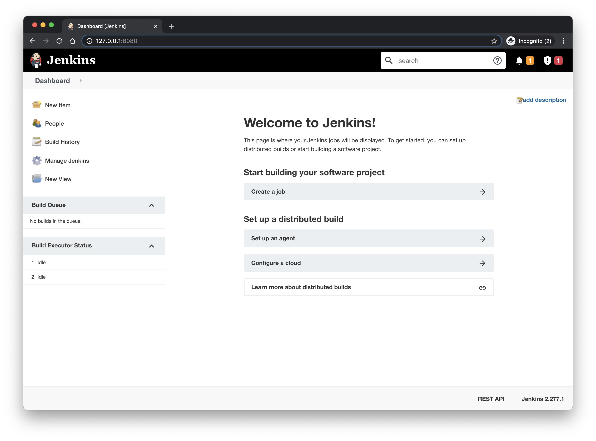

By default the new instance will run in **Security Realm = None** mode which means anyone who has access to the Jenkin's URL can administrate it. This can (and should) be changed by updating the Global Security settings.

`Manage Jenkins` > `Configure Global Security` > **Security Realm**

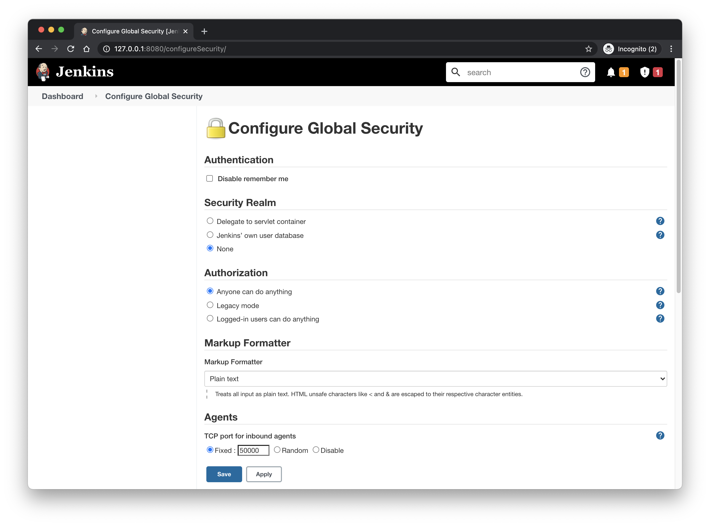

Make sure to address any Administrative and/or Security alerts that are denoted in the upper right portion of the UI.

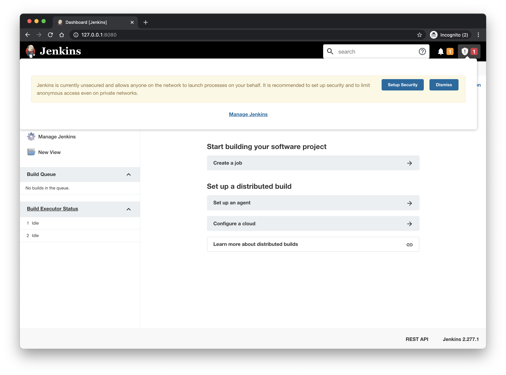
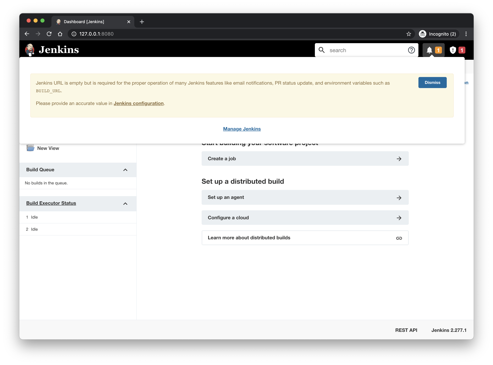

When finished you can issue a `ctrl-c` to kill the running containers and bring down the services. The user will like deploy using the `-d` parameter once they are satisfied with configuration to run the containers in daemonized mode such that they persist beyond the user's terminal session.

### HTTP or HTTPS?

Both of these are protocols for transferring the information of a particular website between the Web Server and Web Browser. But what’s difference between these two? Well, extra "s" is present in https and that makes it secure! 

A very short and concise difference between http and https is that https is much more secure compared to http. https = http + cryptographic protocols.

Main differences between HTTP and HTTPS

- In HTTP, URL begins with [http://]() whereas an HTTPS URL starts with [https://]()
- HTTP uses port number `80` for communication and HTTPS uses `443`
- HTTP is considered to be unsecured and HTTPS is secure
- HTTP Works at Application Layer and HTTPS works at Transport Layer
- In HTTP, Encryption is absent whereas Encryption is present in HTTPS
- HTTP does not require any certificates and HTTPS needs SSL Certificates (signed, unsigned or self generated)

## <a name="https"></a>Basic Deployment using https and SSL

Deploy to [https://127.0.0.1:8443]()

### Configuration

- SSL certificates - use the supplied example certificate pair or provide your own certificates
- `.env` - use the provided file
- `nginx/default.conf` - update the provided file as follows
    - `cp nginx/default.conf.https_template nginx/default.conf`
- `docker-compose.yml` - update the provided file as follows
    - uncomment nginx.ports: `- '8443:443'`
    - uncomment nginx.volumes: `- ${NGINX_SSL:-./ssl}:/etc/ssl:ro`

### Run

```console
docker-compose --env-file .env up
```

Navigate your browser to [https://127.0.0.1:8443]()

Notice that the URL is now using `https` at the beginning and you can view the certificate information
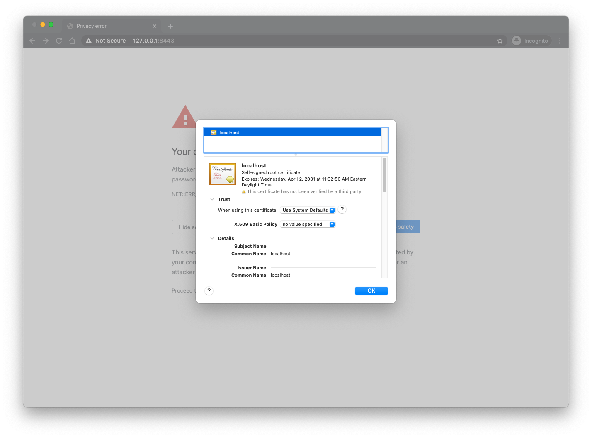

You may need to accept the risk of using a "non trusted" certificate in your browser before it will let you proceed to the site
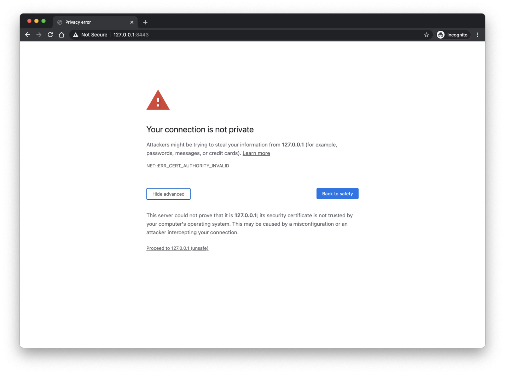

Upon reaching the landing page you should notice something similar to this
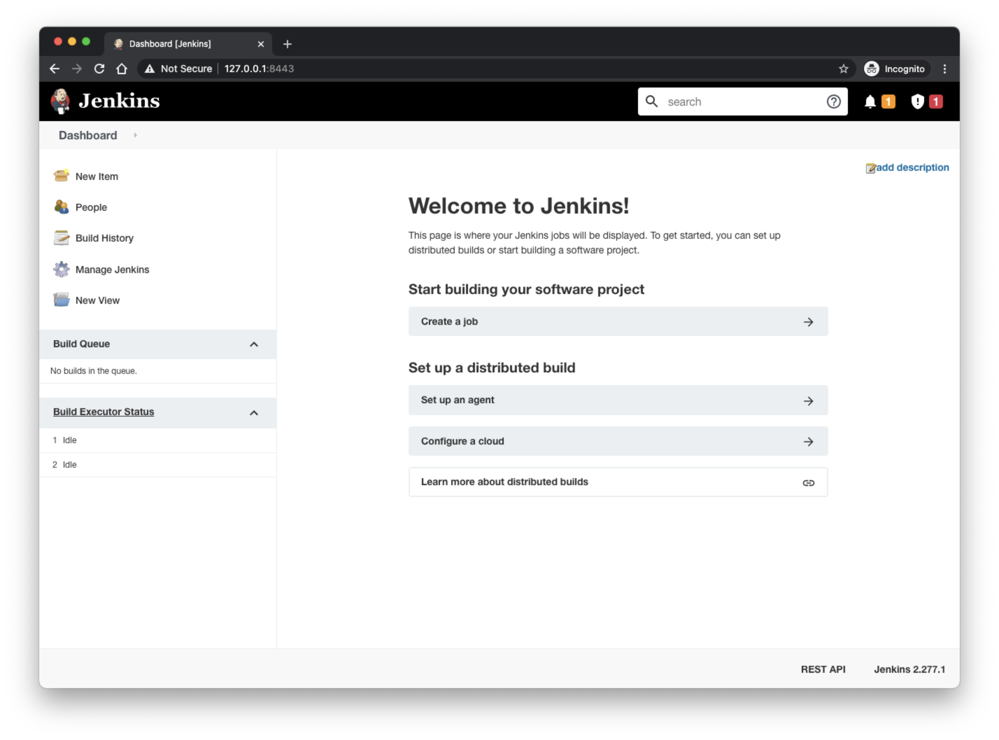


## <a name="custom"></a>Custom Deployment using https with SSL and URL-slug /jenkins

Deploy to [https://127.0.0.1:8443/jenkins]()

### Configuration

- SSL certificates - use the supplied example certificate pair or provide your own certificates
- `.env` - use the provided file
- `nginx/default.conf` - update the provided file as follows
    - `cp nginx/default.conf.custom_template nginx/default.conf`
- `docker-compose.yml` - update the provided file as follows
    - uncomment jenkins.environment: `- JENKINS_OPTS=${JENKINS_OPTS:-"--prefix=/jenkins"}`
    - uncomment nginx.ports: `- '8443:443'`
    - uncomment nginx.volumes: `- ${NGINX_SSL:-./ssl}:/etc/ssl:ro`

### Run

```console
docker-compose --env-file .env up
```

Similar to the https example, the custom example will be running on https and use a SLL certificate. If you navigate to the base URL of [https://127.0.0.1:8443]() you'll get a 404 response since it's not mapped
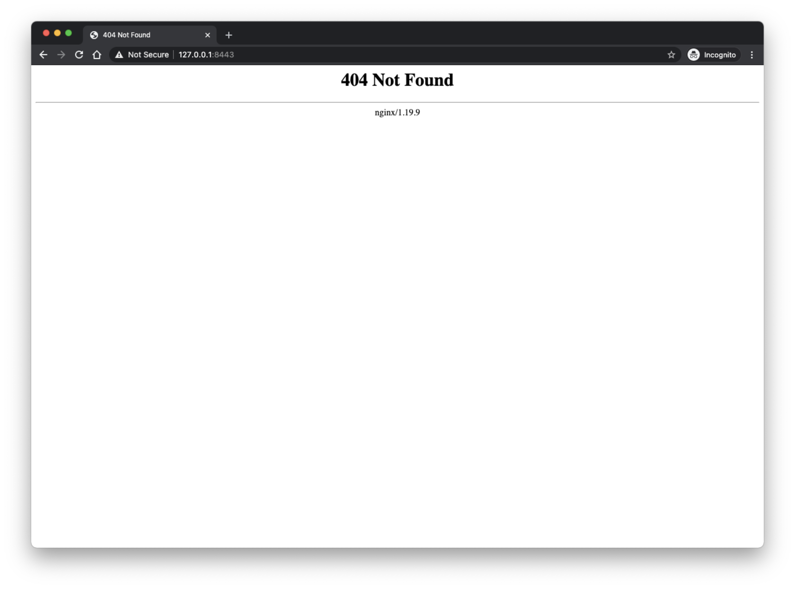

However using the custom URL you'll see the site deployed as expected [https://127.0.0.1:8443/jenkins/]()


## <a name="ssl-certs"></a>SSL Certificates

**What are SSL Certificates?**

SSL Certificates are small data files that digitally bind a cryptographic key to an organization’s details. When installed on a web server, it activates the padlock and the https protocol and allows secure connections from a web server to a browser. Typically, SSL is used to secure credit card transactions, data transfer and logins, and more recently is becoming the norm when securing browsing of social media sites.

SSL Certificates bind together:

- A domain name, server name or hostname.
- An organizational identity (i.e. company name) and location.

See [SSL - certificates for development](ssl/README.md) for more details


## <a name="dind"></a>Docker in Docker test

Create a simple test to verify that the Jenkins installation can run Docker based commands within a job

### Create a new job named "DinD test"

Select "New Item" from the dashboard and create a new Freestyle project

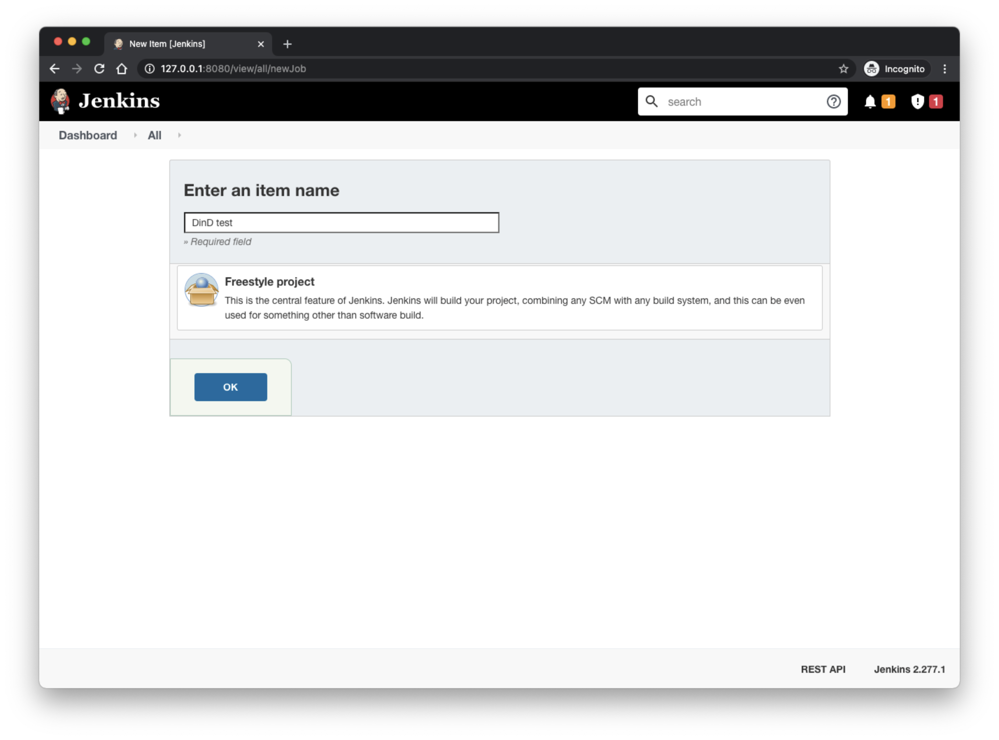

### Add some code to run

Under the "Build" section add a new "Execute Shell" entry with the following and save (**NOTE**: `sudo` is required prior to the `docker` call)

```bash
#!/usr/bin/env bash

sudo docker run hello-world

exit 0;
```

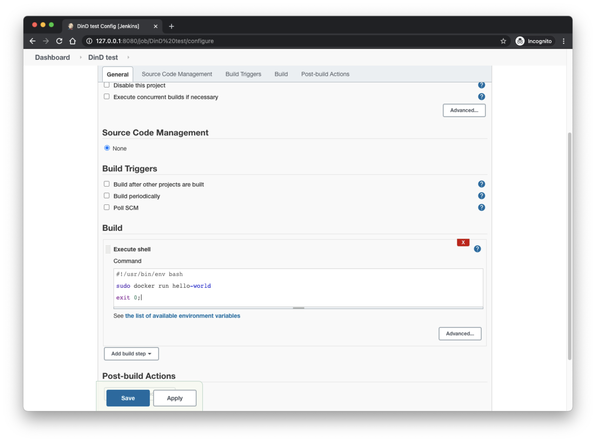

### Run the job

Choose the "Build Now" option from the project's main page and allow it to complete

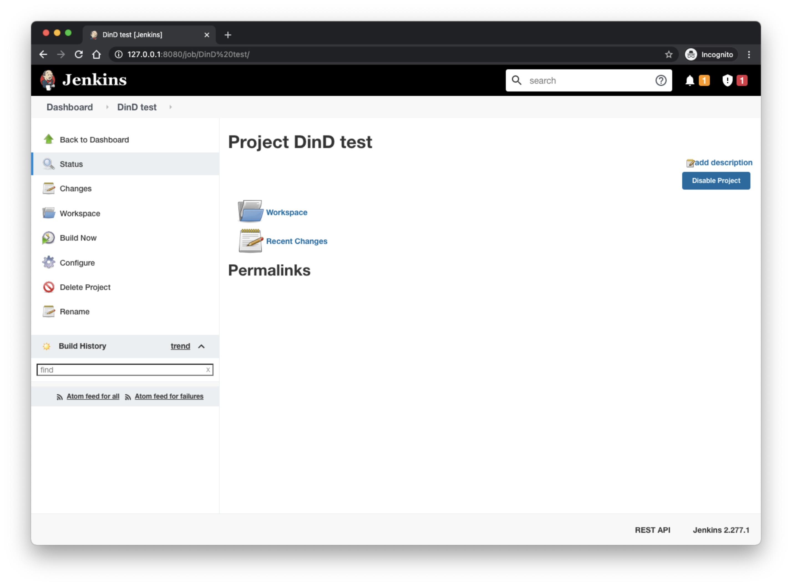

### Verify the output

On completion you should observe a new item in the "Build History", click the numbered job run and then choose to view the "Console Output"

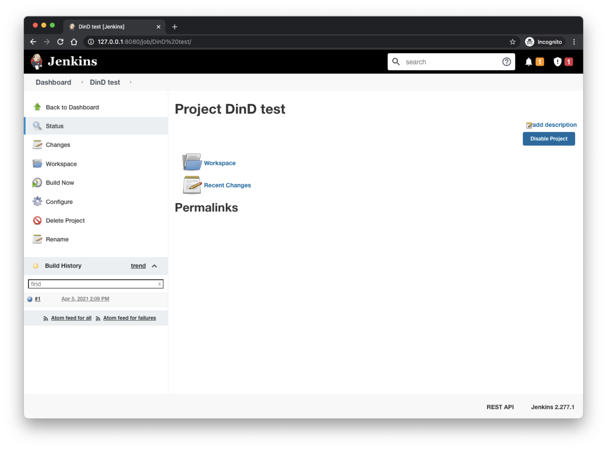

Upon reviewing the Console Ouptut you should see that the job successfully ran the [hello-world](https://hub.docker.com/_/hello-world/) docker container

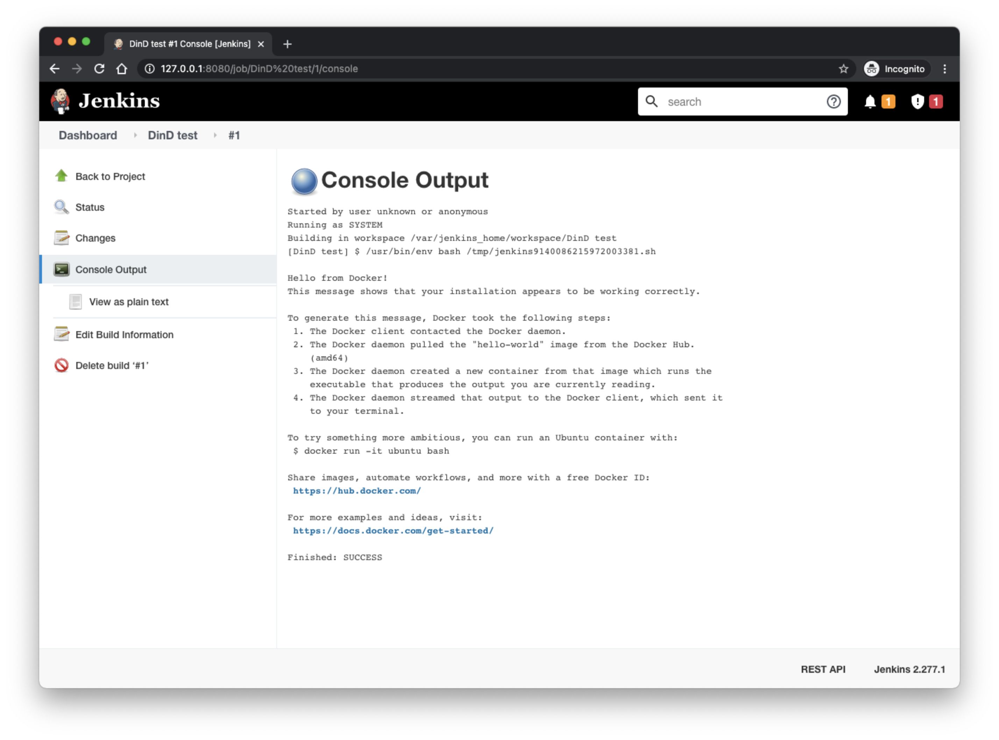


## <a name="debugging"></a>Trouble Shooting

### Nginx configuration

Since the `default.conf` file is mounted from the host it can be updated in real-time. Once changes have been made, the user should validate and reload the configuration.

- Example validation:

  ```console
  $ docker exec nginx /usr/sbin/nginx -t
  nginx: the configuration file /etc/nginx/nginx.conf syntax is ok
  nginx: configuration file /etc/nginx/nginx.conf test is successful
  ```

- Example reload:

  ```console
  $ docker exec nginx /usr/sbin/nginx -s reload
  Reloading nginx: nginx.
  ```


## <a name="ref"></a>References

[1] Official Jenkins Docker Image: [https://hub.docker.com/r/jenkins/jenkins](https://hub.docker.com/r/jenkins/jenkins)

[2] Get into DevOps (blog): [https://getintodevops.com/blog/the-simple-way-to-run-docker-in-docker-for-ci](https://getintodevops.com/blog/the-simple-way-to-run-docker-in-docker-for-ci)

[3] Docker Compose Github Releases: [https://github.com/docker/compose/releases](https://github.com/docker/compose/releases)

[4] Advantage of Tini: [https://github.com/krallin/tini/issues/8](https://github.com/krallin/tini/issues/8)

[5] Jenkins behind an NGinX reverse proxy: [https://www.jenkins.io/doc/book/system-administration/reverse-proxy-configuration-nginx/](https://www.jenkins.io/doc/book/system-administration/reverse-proxy-configuration-nginx/)

Jenkins User Documentation: [https://www.jenkins.io/doc/](https://www.jenkins.io/doc/)
