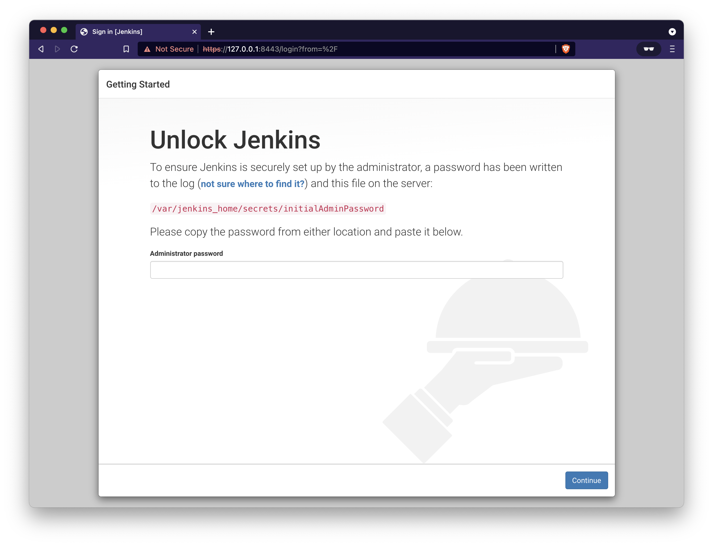
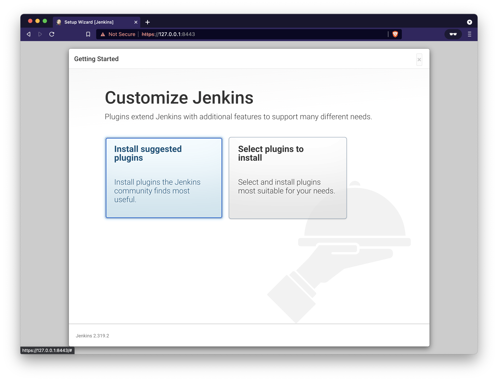
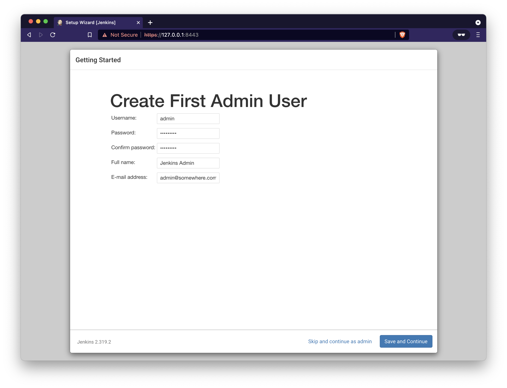
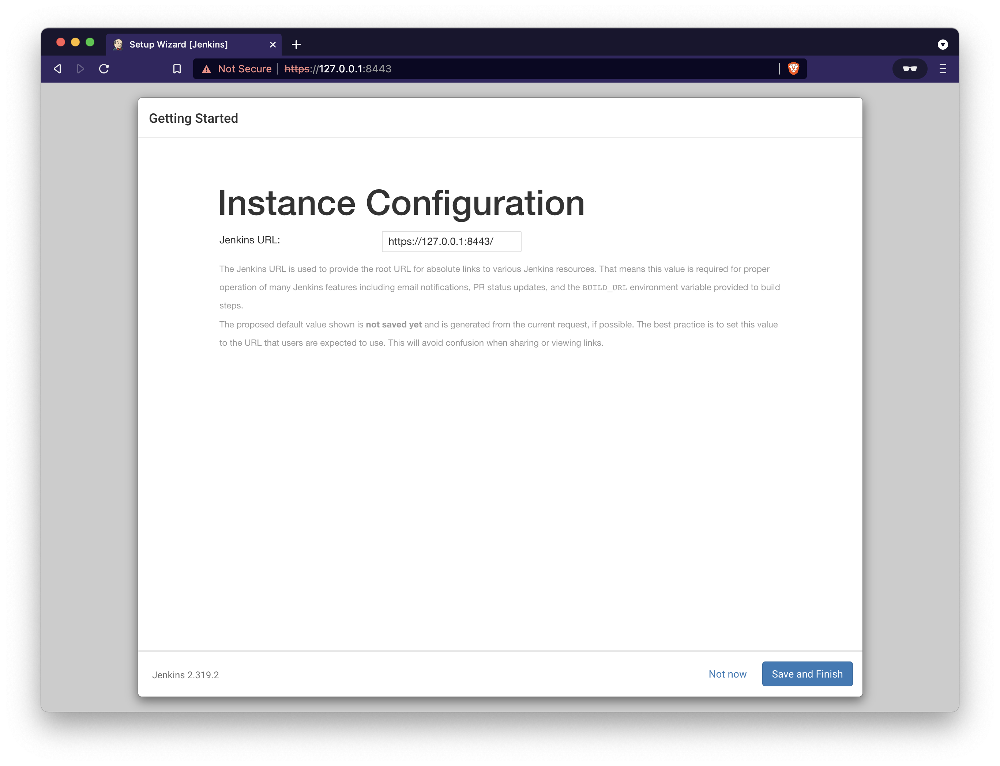
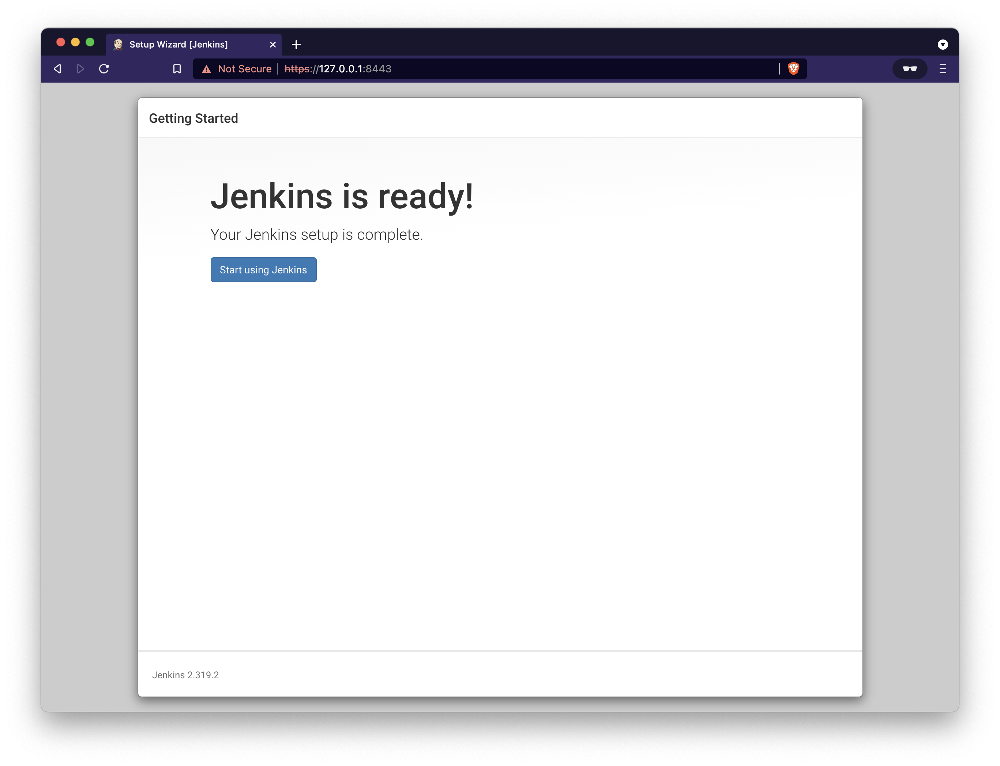
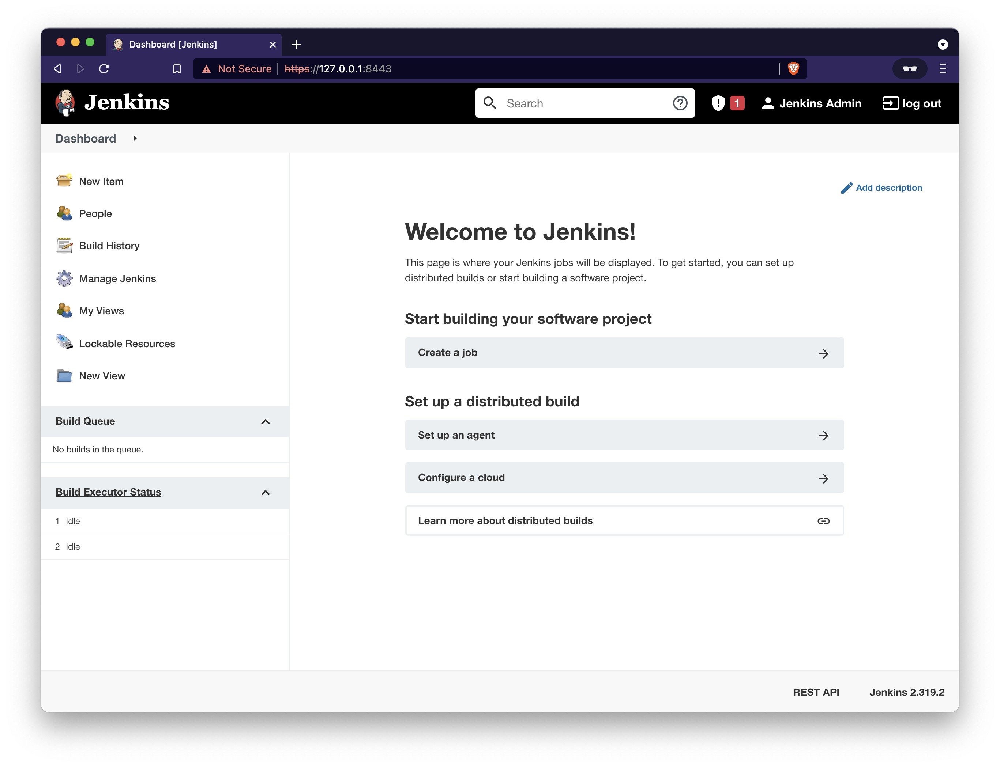
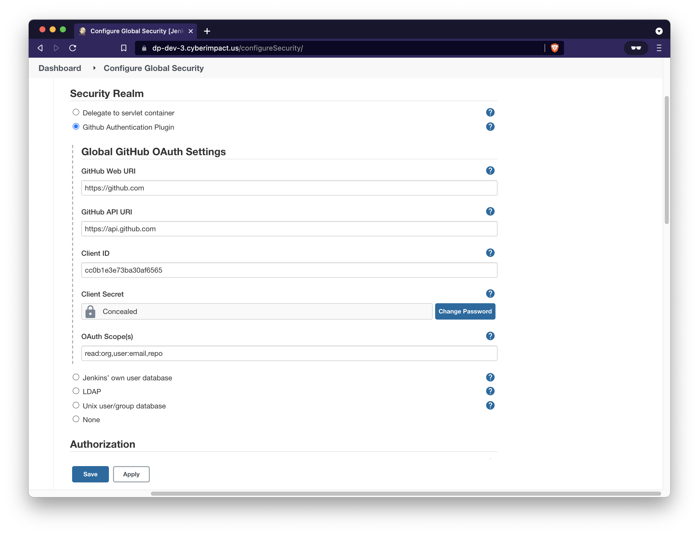
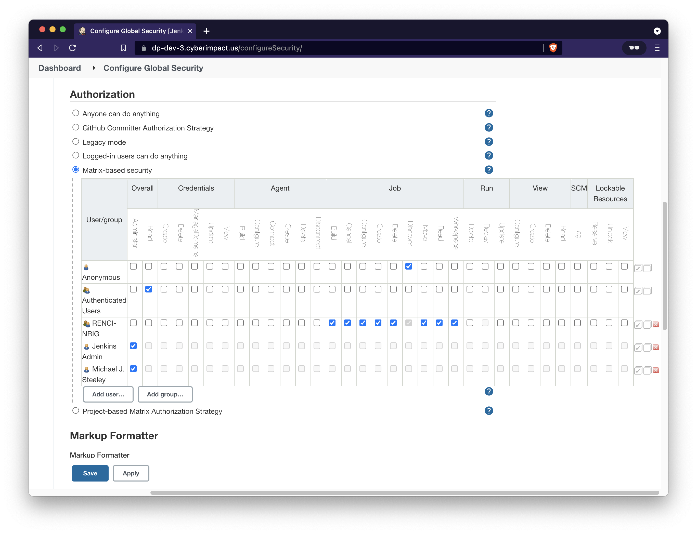

# Jenkins LTS - Docker

Notes on [Jenkins LTS](https://www.jenkins.io/download/lts/#ji-toolbar) as a docker deployment orchestrated by Docker Compose. (version denoted at the time of writing this document)

- Use the LTS version of Jenkins (v2.319.2)
- Use Nginx as the web server (v1)
- Include self-signed SSL certificate (Let's Encrypt localhost format)

**DISCLAIMER: The code herein may not be up to date nor compliant with the most recent package and/or security notices. The frequency at which this code is reviewed and updated is based solely on the lifecycle of the project for which it was written to support, and is not actively maintained outside of that scope. Use at your own risk.**

## Table of contents

- [Overview](#overview)
    - [Host Requirements](#reqts)
- [Configuration](#config)
- [Deploy](#deploy)
- [GitHub OAuth integration](#github)
- [Teardown](#teardown)
- [References](#references)
- [Notes](#notes)

## <a name="overview"></a>Overview

Jenkins offers a simple way to set up a continuous integration or continuous delivery environment for almost any combination of languages and source code repositories using pipelines, as well as automating other routine development tasks. While Jenkins doesn’t eliminate the need to create scripts for individual steps, it does give you a faster and more robust way to integrate your entire chain of build, test, and deployment tools than you can easily build yourself.


- This work is based on the **Official Jenkins LTS Docker Image** [jenkins/jenkins:lts-jdk11](https://github.com/jenkinsci/docker)
- Installs some prerequisites, configures the official Docker apt repositories and installs the latest **Docker CE** binaries
- Mount the host machine's **Docker socket** in the container (This will allow your container to use the host machine's Docker daemon to run containers and build images).

### <a name="reqts"></a>Host requirements

Both Docker and Docker Compose are required on the host to run this code

- Install Docker Engine: [https://docs.docker.com/engine/install/](https://docs.docker.com/engine/install/)
- Install Docker Compose: [https://docs.docker.com/compose/install/](https://docs.docker.com/compose/install/)

## <a name="config"></a>Configuration

Copy the `env.template` file as `.env` and populate according to your environment

```ini
# docker-compose environment file
#
# When you set the same environment variable in multiple files,
# here’s the priority used by Compose to choose which value to use:
#
#  1. Compose file
#  2. Shell environment variables
#  3. Environment file
#  4. Dockerfile
#  5. Variable is not defined

# Jenkins Settings
export JENKINS_LOCAL_HOME=./jenkins_home
export JENKINS_UID=1000
export JENKINS_GID=1000
export HOST_DOCKER_SOCK=/var/run/docker.sock

# Nginx Settings
export NGINX_CONF=./nginx/default.conf
export NGINX_SSL_CERTS=./ssl
export NGINX_LOGS=./logs/nginx

# User Settings
# TBD
```

Modify `nginx/default.conf` and replace `$host:8443` with your server domain name and port throughout the file

```conf
upstream jenkins {
    keepalive 32;              # keepalive connections
    server cicd-jenkins:8080;  # jenkins container ip and port
}

# Required for Jenkins websocket agents
map $http_upgrade $connection_upgrade {
    default upgrade;
    '' close;
}

server {
    listen 80;                    # Listen on port 80 for IPv4 requests
    server_name $host;
    return 301 https://$host:8443$request_uri; # replace '8443' with your https port
}

server {
    listen          443 ssl;      # Listen on port 443 for IPv4 requests
    server_name     $host:8443;   # replace '$host:8443' with your server domain name and port

    # SSL certificate - replace as required with your own trusted certificate
    ssl_certificate /etc/ssl/fullchain.pem;
    ssl_certificate_key /etc/ssl/privkey.pem;

    # logging
    access_log      /var/log/nginx/jenkins.access.log;
    error_log       /var/log/nginx/jenkins.error.log;

    # this is the jenkins web root directory
    # (mentioned in the /etc/default/jenkins file)
    root            /var/jenkins_home/war/;

    # pass through headers from Jenkins that Nginx considers invalid
    ignore_invalid_headers off;

    location ~ "^/static/[0-9a-fA-F]{8}\/(.*)$" {
        # rewrite all static files into requests to the root
        # E.g /static/12345678/css/something.css will become /css/something.css
        rewrite "^/static/[0-9a-fA-F]{8}\/(.*)" /$1 last;
    }

    location /userContent {
        # have nginx handle all the static requests to userContent folder
        # note : This is the $JENKINS_HOME dir
        root /var/jenkins_home/;
        if (!-f $request_filename) {
            # this file does not exist, might be a directory or a /**view** url
            rewrite (.*) /$1 last;
            break;
        }
        sendfile on;
    }

    location / {
        sendfile off;
        proxy_pass         http://jenkins;
        proxy_redirect     default;
        proxy_http_version 1.1;

        # Required for Jenkins websocket agents
        proxy_set_header   Connection        $connection_upgrade;
        proxy_set_header   Upgrade           $http_upgrade;

        proxy_set_header   Host              $host;
        proxy_set_header   X-Real-IP         $remote_addr;
        proxy_set_header   X-Forwarded-For   $proxy_add_x_forwarded_for;
        proxy_set_header   X-Forwarded-Proto $scheme;
        proxy_set_header   X-Forwarded-Host  $host;
        proxy_set_header   X-Forwarded-Port  8443; # replace '8443' with your https port
        proxy_max_temp_file_size 0;

        #this is the maximum upload size
        client_max_body_size       10m;
        client_body_buffer_size    128k;

        proxy_connect_timeout      90;
        proxy_send_timeout         90;
        proxy_read_timeout         90;
        proxy_buffering            off;
        proxy_request_buffering    off; # Required for HTTP CLI commands
        proxy_set_header Connection ""; # Clear for keepalive
    }

}
```

## <a name="deploy"></a>Deploy

Once configured the containers can be brought up using Docker Compose

```console
source .env
docker-compose pull
docker-compose build
docker-compose up -d
```

After a few moments the containers should be observed as running

```console
$ docker-compose ps
NAME                COMMAND                  SERVICE             STATUS              PORTS
cicd-jenkins        "/sbin/tini -- /dock…"   jenkins             running             0.0.0.0:50000->50000/tcp
cicd-nginx          "/docker-entrypoint.…"   nginx               running             0.0.0.0:8080->80/tcp, 0.0.0.0:8443->443/tcp
```

The Jenkins application can be reached at the designated host and port (e.g. [https://127.0.0.1:8443]()).

- **NOTE**: you will likely have to acknowledge the security risk if using the included self-signed certificate.



Copy the `Administrator password` from the docker log output of the jenkins container.

```console
$ docker-compose logs jenkins
cicd-jenkins  | usermod: no changes
...
cicd-jenkins  | 2022-01-26 16:37:12.863+0000 [id=34]	INFO	jenkins.install.SetupWizard#init:
cicd-jenkins  |
cicd-jenkins  | *************************************************************
cicd-jenkins  | *************************************************************
cicd-jenkins  | *************************************************************
cicd-jenkins  |
cicd-jenkins  | Jenkins initial setup is required. An admin user has been created and a password generated.
cicd-jenkins  | Please use the following password to proceed to installation:
cicd-jenkins  |
cicd-jenkins  | 1cd0eea03abc4ff1b184547625dd48f2
cicd-jenkins  |
cicd-jenkins  | This may also be found at: /var/jenkins_home/secrets/initialAdminPassword
cicd-jenkins  |
cicd-jenkins  | *************************************************************
cicd-jenkins  | *************************************************************
cicd-jenkins  | *************************************************************
cicd-jenkins  |
cicd-jenkins  | 2022-01-26 16:37:24.156+0000 [id=34]	INFO	jenkins.InitReactorRunner$1#onAttained: Completed initialization
```

Install the plugins you are interested in



Setup an Administrative user



Confirm the URL and start using Jenkins





## <a name="github"></a>GitHub OAuth integration

**GOAL**: Use GitHub to authenticate user access into Jenkins and authorize actions within it

- Authorization is delegated using **Matrix-based security** by `organization` or `organization*repo` represented as **Group** membership at the user level
- Do **NOT** log off the initial Administrator account prior to establishing a new Administrative User or Group that is accessible to an authorized GitHub user
    - Once the **GitHub Authentication Plugin** is activated you will lose the standard login option of Username/Password
    - After installing, the `<securityRealm>` class should have been updated in your `/var/lib/jenkins/config.xml` file. The value of `<clientID>` should agree with what you pasted into the admin UI. If it doesn't or you still can't log in, reset to `<securityRealm class="hudson.security.HudsonPrivateSecurityRealm">` and restart Jenkins from the command-line.

### Install the GitHub OAuth Plugin

- From Plugin Manager search for [GitHub Authentication](https://plugins.jenkins.io/github-oauth/)
- Download and install after restart

### Setup

Before configuring the plugin you must create a GitHub application registration.

1. Visit [https://github.com/settings/applications/new](https://github.com/settings/applications/new) to create a GitHub application registration.
2. The values for application name, homepage URL, or application description don't matter. They can be customized however desired.
3. However, the authorization callback URL takes a specific value. It must be `https://jenkins.example.com/securityRealm/finishLogin` where jenkins.example.com is the location of the Jenkins server.
The important part of the callback URL is `/securityRealm/finishLogin`
4. Finish by clicking Register application.

The `Client ID` and the `Client Secret` will be used to configure the Jenkins Security Realm. Keep the page open to the application registration so this information can be copied to your Jenkins configuration.

### Security Realm in Global Security

The security realm in Jenkins controls authentication (i.e. you are who you say you are). The GitHub Authentication Plugin provides a security realm to authenticate Jenkins users via GitHub OAuth.

1. In the Global Security configuration choose the Security Realm to be **GitHub Authentication Plugin**.
2. The settings to configure are: GitHub Web URI, GitHub API URI, Client ID, Client Secret, and OAuth Scope(s).
3. If you're using GitHub Enterprise then the API URI is [https://ghe.example.com/api/v3]().
The GitHub Enterprise API URI ends with `/api/v3`.
4. The recommended minimum GitHub OAuth scopes are `read:org,user:email`.
The recommended scopes are designed for using both authentication and authorization functions in the plugin. If only authentication is being used then the scope can be further limited to `(no scope)` or `user:email`.

In the plugin configuration pages each field has a little (**?**) next to it. Click on it for help about the setting.



### Authorization in Global Security.

The authorization configuration in Jenkins controls what your users can do (i.e. read jobs, execute builds, administer permissions, etc.). The GitHub OAuth Plugin supports multiple ways of configuring authorization.

It is highly recommended that you configure the security realm and log in via GitHub OAuth before configuring authorization. This way Jenkins can look up and verify users and groups if configuring matrix-based authorization.

### Matrix-based Authorization strategy

Control user authorization using **Matrix-based security** or **Project-based Matrix Authorization Strategy**. Project-based Matrix Authorization Strategy allows one to configure authorization globally per project and, when using Project-based Matrix Authorization Strategy with the CloudBees folder plugin, per folder.

There are a few built-in authorizations to consider.

- `anonymous` - is anyone who has not logged in. Recommended permissions are just `Job/Discover` and `Job/ViewStatus`.
- `authenticated` - is anyone who has logged in. You can configure permissions for anybody who has logged into Jenkins. Recommended permissions are `Overall/Read` and `View/Read`.
`anonymous` and `authenticated` usernames are case sensitive and must be lower case. This is a consideration when configuring authorizations via Groovy. Keep in mind that anonymous shows up as Anonymous in the Jenkins UI.

You can configure authorization based on GitHub users, organizations, or teams.

- `username` - give permissions to a specific GitHub username.
- `organization` - give permissions to every user that belongs to a specific GitHub organization.
- `organization*team` - give permissions to a specific GitHub team of a GitHub organization. Notice that organization and team are separated by an asterisk (*).



Related to the screenshot above:

- User: `Michael J. Stealey` is an Administrative user that authenticated using the GitHub OAuth Plugin
- User: `Jenkins Admin` is the original admin account but is no longer reachable using the GitHub OAuth Plugin
- Group: `RENCI-NRIG` is a GitHub Organization reflected as a Group for any users who belong to that organization and is being used to set **Job** based authorizations within Jenkins

**Reference**: 

- Documentation: [https://plugins.jenkins.io/github-oauth/](https://plugins.jenkins.io/github-oauth/)
- GitHub: [https://github.com/jenkinsci/github-oauth-plugin](https://github.com/jenkinsci/github-oauth-plugin)

## <a name="teardown"></a>Teardown

For a complete teardown all containers must be stopped and removed along with the volumes and network that were created for the application containers

Commands

```console
docker-compose stop
docker-compose rm -fv
docker-network rm cicd-jenkins
# removal calls may require sudo rights depending on file permissions
rm -rf ./jenkins_home
rm -rf ./logs
```

Expected output

```console
$ docker-compose stop
[+] Running 2/2
 ⠿ Container cicd-nginx    Stopped                                                                                                     0.9s
 ⠿ Container cicd-jenkins  Stopped                                                                                                     1.0s
$ docker-compose rm -fv
Going to remove cicd-nginx, cicd-jenkins
[+] Running 2/0
 ⠿ Container cicd-jenkins  Removed                                                                                                     0.0s
 ⠿ Container cicd-nginx    Removed                                                                                                     0.0s
$ docker network rm cicd-jenkins
cicd-jenkins
$ rm -rf ./jenkins_home
$ rm -rf ./logs
```

## <a name="references"></a>References

- Jenkins Docker images: [https://github.com/jenkinsci/docker](https://github.com/jenkinsci/docker)
- Jenkins Documentation: [https://www.jenkins.io/doc/](https://www.jenkins.io/doc/)
- Docker Documentation: [https://docs.docker.com](https://docs.docker.com)

---

## <a name="notes"></a>Notes

General information regarding standard Docker deployment of Jenkins for reference purposes

### Host volume mounts

The provided configuration creates two host volume mounts that may require some permissions adjustments to work correctly.

1. `${JENKINS_LOCAL_HOME}:/var/jenkins_home` - Maps the `/var/jenkins_home` directory inside the `jenkins` container to the Docker volume identified by `${JENKINS_LOCAL_HOME}`. Other Docker containers controlled by this Docker container’s Docker daemon can mount data from Jenkins (e.g. the Nginx container).

    Generally speaking it is suggested to set the jenkins user UID and GID values to that of the user running the application.
    
    ```console
    $ id -u
    1011
    $ id -g
    1011
    ```
    
    Then in the `.env` file set
    
    ```ini
    ...
    export JENKINS_UID=1011
    export JENKINS_GID=1011
    ...
    ```

2. `${NGINX_LOGS}:/var/log/nginx` - Maps the `/var/log/nginx` directory inside the `nginx` container to the Docker volume identified by `${NGINX_LOGS}`

    There is no easy to change user UID/GID flag in Nginx, you either need to rebuild the Docker image with a custom UID/GID set, or just accept the log output as it is and use a privileged account to modify the files if needed.

### Deploy with /jenkins prefix

At times it is desirable to run Jenkins at a non-root URL such as [https://127.0.0.1:8443/jenkins]()

This can be achieved by adjusting a few parameters

1. Modify the `docker-compose.yml` file to include in `JENKINS_OPTS`

    ```yaml
    ...
      jenkins:
        # default ports 8080, 50000 - expose mapping as needed to host
        build:
          context: ./jenkins
          dockerfile: Dockerfile
        container_name: cicd-jenkins
        restart: unless-stopped
        networks:
          - jenkins
        ports:
          - "50000:50000"
        environment:
          # Uncomment JENKINS_OPTS to add prefix: e.g. https://127.0.0.1:8443/jenkins
          - JENKINS_OPTS="--prefix=/jenkins"  # <-- Uncomment this line
          - JENKINS_UID=${JENKINS_UID}
          - JENKINS_GID=${JENKINS_GID}
        volumes:
          - ${JENKINS_LOCAL_HOME}:/var/jenkins_home
          - ${HOST_DOCKER_SOCK}:/var/run/docker.sock
    ```

2. Modify `.env` to use the `nginx/prefix_jenkins.conf` file instead of `nginx/default.conf`

    ```ini
    ...
    # Nginx Settings
    export NGINX_CONF=./nginx/prefix_jenkins.conf
    export NGINX_SSL_CERTS=./ssl
    export NGINX_LOGS=./logs/nginx
    ```

3. Follow the **Deploy** instructions from above

### Let's Encrypt SSL Certificate

Use: [https://github.com/RENCI-NRIG/ez-letsencrypt](https://github.com/RENCI-NRIG/ez-letsencrypt) - A shell script to obtain and renew [Let's Encrypt](https://letsencrypt.org/) certificates using Certbot's `--webroot` method of [certificate issuance](https://certbot.eff.org/docs/using.html#webroot).
